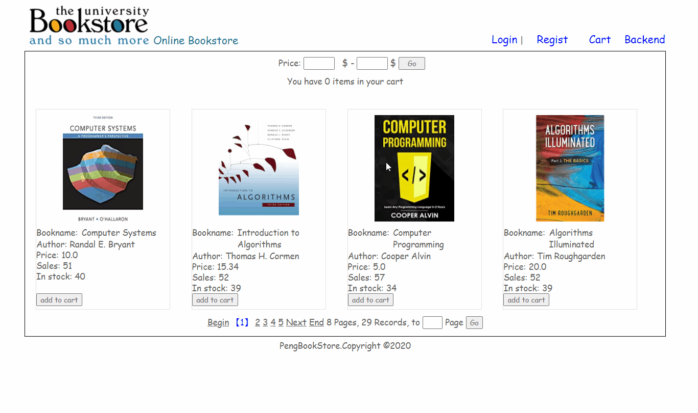
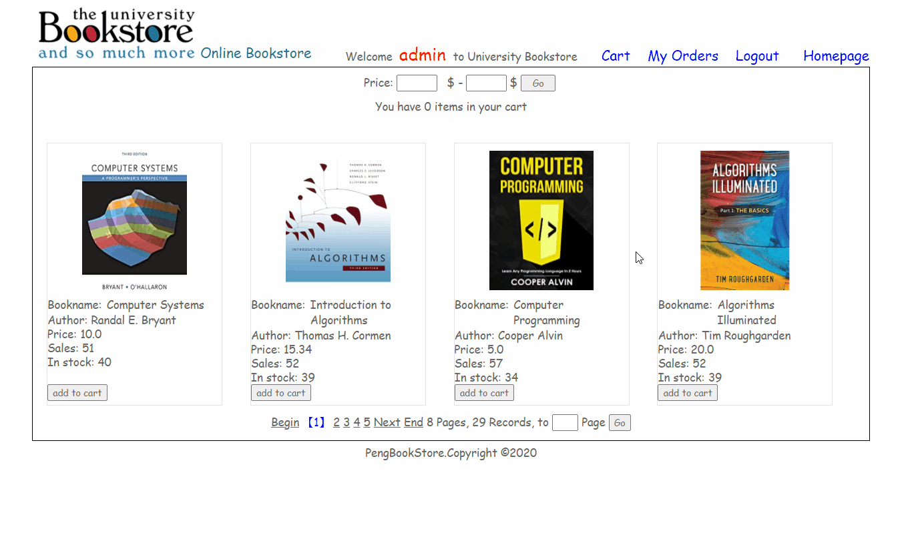
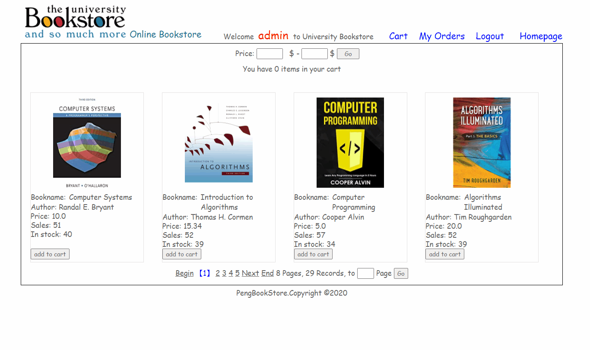
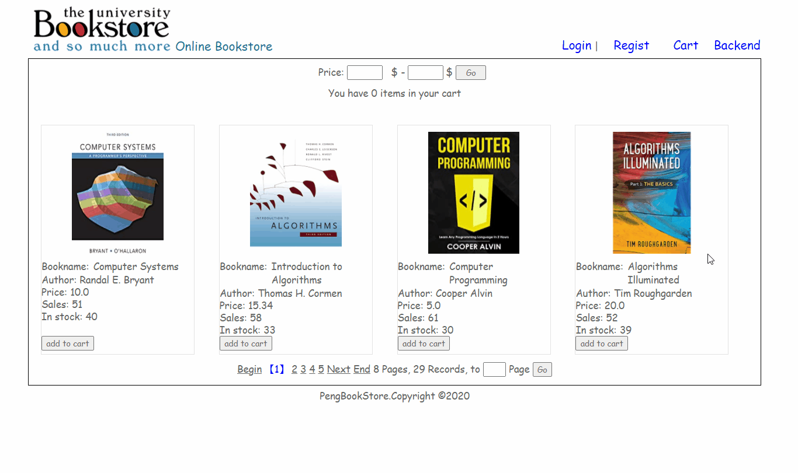

# BookStore_08_intelliJ
intelliJ version of bookstore_08
Building an online bookstore with frontend(jsp&html&css, JavaScript&jQuery) backend(tomcat, Servlet, Filter, ajax) and database(mysql, jdbc). Website can be accessed at http://jiapeng.tk/BookStore_08/  

Code of frontend is located under BookStore_JavaWeb/BookStore_08/WebContent/.  

Code of backend is located under BookStore_JavaWeb/BookStore_08/src/peng/  

Used java packages are located under BookStore_JavaWeb/BookStore_08/WebContent/WEB-INF/lib/  

Using Apache Tomcat 6.0.39  

## How to run
1. download code of folder Bookstore_08. Import it as a project in your eclipse workspace.  
2. initialize your database somewhere with the database.sql statement. modify /BookStore_08/conf/c3p0-config.xml to configure your database ip and password.
3. create a tomcat server, run BookStore_08/WebContent/index.jsp on server

## Modules
### User regist && login
user register:  
  
user login:  
  
### Homepage
searching by price：  
 
### Backend system for administrator
book manager:  
book CRUD:  
 
order manager:  
 
### Order && Cart
go checkout and ship the order: 
 

